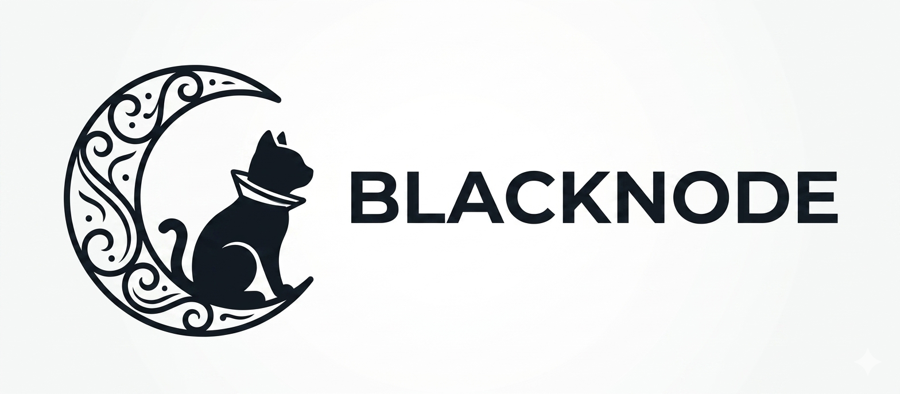

<p align="center">
  
</p>


<h1 align="center">BlackNode // Your Setup</h1>
<div align="center">

<a href="https://github.com/zhaleff/BlackNode/stargazers"></a>&nbsp;&nbsp;
<a href="https://github.com/zhaleff/BlackNode/forks"></a>&nbsp;&nbsp;
<a href="https://github.com/zhaleff/BlackNode/issues"></a>&nbsp;&nbsp;
<a href="https://github.com/zhaleff/BlackNode/commits/main"></a>&nbsp;&nbsp;
<a href="https://github.com/zhaleff/BlackNode/blob/main/LICENSE"></a>&nbsp;&nbsp;


</div>

#

<div align="center">

<a href="#installation"><kbd> <br> Installation <br> </kbd></a>&ensp;&ensp;
<a href="#manual-install"><kbd> <br> Manual Install <br> </kbd></a>&ensp;&ensp;
<a href="#showcase"><kbd> <br> Showcase <br> </kbd></a>&ensp;&ensp;
<a href="./KEYBINDS.md"><kbd> <br> Keybindings <br> </kbd></a>&ensp;&ensp;
<a href="./WAYBAR.md"><kbd> <br> Waybar <br> </kbd></a>&ensp;&ensp;
<a href="./MODULES.md"><kbd> <br> Modules <br> </kbd></a>&ensp;&ensp;
<a href="./REFERENCE.md"><kbd> <br> Reference <br> </kbd></a>&ensp;&ensp;


</div>

#

<div align="center">
  <h3>Your home in the terminal. Simple, clean, yours.</h3>
  <p><i>Dotfiles that embrace, not complicate.</i></p>
</div>

#

<a id="hello"></a>


BlackNode is my personal Linux configuration. It grew from years of tweaking, breaking, and slowly understanding what makes a system feel like home. It is not a monolithic rice you copy and forget. It is a living set of files, each one written to be read, understood, and eventually changed by you.

Every tool in this setup was chosen deliberately. Nothing is here just because it is popular. Each component has its own independent install script — you run only what you need, nothing runs without your input.


#

<a id="stack"></a>


| Component | Tool | Role |
|---|---|---|
| Window Manager | Hyprland | Dynamic tiling Wayland compositor |
| Status Bar | Waybar | Fully configurable bar |
| Terminal | Kitty + Alacritty | GPU-accelerated terminal emulators |
| Shell | Zsh + Powerlevel10k | Fast shell with a powerful prompt |
| Launcher | Rofi | App launcher and dmenu replacement |
| Notifications | Dunst | Lightweight notification daemon |
| Lockscreen | Hyprlock + Hypridle | GPU-accelerated lock with idle management |
| File Manager | Yazi | Blazing-fast terminal file manager |
| Editor | Neovim | Extensible modal text editor |
| Theming | Matugen | Material You colours generated from your wallpaper |
| Wallpaper | awww | GPU-accelerated Wayland wallpaper daemon |
| Clipboard | Clipse | Persistent clipboard history for Wayland |
| Audio | Cava | Terminal audio visualiser |
| Logout | Wlogout | Clean session management screen |
| System Info | Fastfetch | Fast, customisable fetch tool |
| AUR Helper | yay | AUR package manager |


#

<a id="installation"></a>


BlackNode is designed for a minimal [Arch Linux](https://wiki.archlinux.org/title/Arch_Linux) install. It may work on Arch-based distros, but this has not been tested on all of them.

> [!IMPORTANT]
> Installing BlackNode alongside another DE or WM should work, but it **will** overwrite your GTK, Qt, SDDM, shell and Zsh configuration. Proceed at your own risk.

> [!NOTE]
> ```linkdots.sh``` will create symbolic links for your configuration files—from blacknode—for the installation.
Clone the repository and run the main installer:

```bash
git clone https://github.com/zhaleff/BlackNode.git $HOME/BlackNode
cd $HOME/BlackNode 

``` 

> [!TIP]
> I recommend reading the preliminary documentation that explains in detail how to install the dotfile. 
> 
<a href="#installation"><kbd> <br> Installation <br> </kbd></a>&ensp;&ensp;


Please reboot after the installer completes for all changes to take effect.

#
<a id="words"></a>


I have been where you are. I have stared at other people's dotfiles, overwhelmed by the complexity, convinced I could never create something like that. But I started small. I copied one line, then another. I broke things and fixed them. And slowly, it became mine.

You can do this. You are capable of more than you know. All it takes is the courage to start, the patience to learn from mistakes, and the belief that you belong here.

BlackNode is not the answer. It is just a starting point. The real answer is inside you.

Now go. Explore. Break things. Fix them. And make this your own.


#

<a id="licence"></a>


BlackNode is released under the [MIT Licence](./LICENSE). You are free to use, modify, and share it however you wish. Attribution is appreciated but not required.

#

<div align="center">
  <p>Made with ❤️ by <a href="https://github.com/zhaleff">zhaleff</a></p>
  <p><i>Happy hacking.</i></p>
</div>

<div align="right">
  <sub>Last edited on: 2026</sub>
</div>

